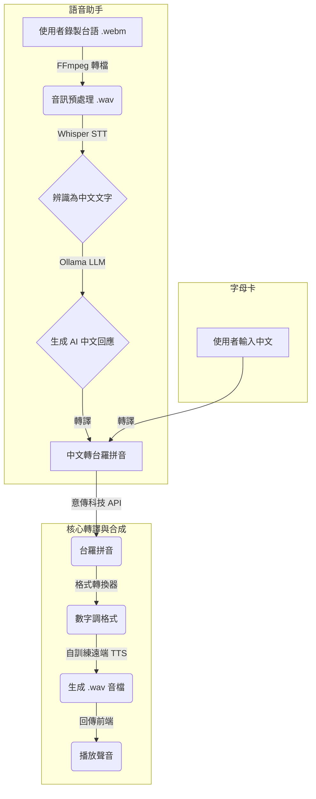

# 台語語音對話與學習系統

本專案是一個整合了語音辨識（STT）、大型語言模型（LLM）、台語標音和語音合成（TTS）的 Web 應用，旨在提供一個功能完整、互動流暢的台語學習與交流平台。

## ✨ 核心功能

- **🤖 智能語音助手**：
  - **即時台語辨識**：透過瀏覽器錄製台語，系統能即時將語音轉換為文字。
  - **AI 智能對話**：整合本地大型語言模型（Ollama + Llama3/Gemma），提供自然且有上下文的對話回應。
  - **台語語音輸出**：將 AI 的文字回應合成為自然的台語語音並播放。

- **📇 台語字母卡 (Flashcard)**：
  - **文字轉拼音**：輸入中文詞彙，系統會產生對應的台羅拼音。
  - **互動式卡片**：可點擊翻轉卡片，在中文和羅馬拼音之間切換學習。
  - **即時發音**：點擊播放按鈕，即可聽到該詞彙的標準台語發音。

- **🚀 高效能設計**：
  - **GPU 加速支援**：自動偵測並使用 NVIDIA GPU（CUDA）加速語音辨識，大幅提升反應速度。
  - **非同步處理**：流暢的前端體驗，處理過程不鎖定使用者介面。

## 🛠️ 技術架構

### 處理流程


### 技術堆疊
- **前端**：HTML5 / CSS3 / JavaScript (Web Audio API)
- **後端**：Flask (Python 3.8+)
- **語音辨識 (STT)**：OpenAI Whisper (使用 `NUTN-KWS/Whisper-Taiwanese-model-v0.5` 台語特化模型)
- **大型語言模型 (LLM)**：Ollama (支援 Llama3, Gemma2 等模型)
- **台語標音服務**：意傳科技 (iTaigi) 標音 API
- **語音合成 (TTS)**：自訓練之遠端 TTS 服務
- **硬體加速**：NVIDIA CUDA

## ⚙️ 安裝與啟動教學

請遵循以下步驟來設定並啟動專案。

### 1. 前置需求
- **硬體**：
  - 一部有麥克風的電腦。
  - [**建議**] 一張支援 CUDA 的 NVIDIA 顯示卡，以獲得最佳效能。
- **軟體**：
  - Python 3.8 或更高版本。
  - FFmpeg 音訊處理工具。
  - Ollama 服務。

### 2. 下載專案與工具
- **下載本專案**：
  ```bash
  git clone https://github.com/Gskdl78/Taiwanese-Voice-Assistant.git
  cd Taiwanese-Voice-Assistant
  ```
- **安裝 Ollama**：
  - 前往 [Ollama 官網](https://ollama.com/download) 下載並安裝適合您作業系統的版本。
  - 安裝後，打開終端機執行以下指令來下載一個對話模型（以 `gemma2` 為例）：
    ```bash
    ollama pull gemma2:2b
    ```
- **準備 FFmpeg**：
  - 請確保 `ffmpeg.exe` 檔案位於專案根目錄下的 `ffmpeg_bin/` 資料夾中。

### 3. 設定虛擬環境 (非常重要！)

使用虛擬環境可以將本專案的 Python 套件與您電腦全域的套件隔離開來，避免版本衝突。**每次開啟新的終端機要啟動專案時，都必須先啟用虛擬環境。**

- **建立虛擬環境** (只需做一次)：
  在專案根目錄下，執行指令：
  ```powershell
  python -m venv venv
  ```
  這會建立一個名為 `venv` 的資料夾，存放所有相關套件。

- **啟用虛擬環境** (每次都要做)：
  在 Windows PowerShell 中，執行指令：
  ```powershell
  .\venv\Scripts\activate
  ```
  成功啟用後，您的終端機提示字元前方會出現 `(venv)` 字樣。

- **安裝依賴套件**：
  確認您已在虛擬環境中 (有看到 `(venv)`)，然後執行指令：
  ```powershell
  pip install -r requirements.txt
  ```
  這會自動安裝所有本專案需要的 Python 函式庫。如果要使用 GPU，請確保您安裝的是支援 CUDA 的 PyTorch 版本。

### 4. 啟動應用程式

在**已啟用虛擬環境**的終端機中 (必須看到 `(venv)` 前綴)，執行以下指令：
```powershell
python app.py
```

當您在終端機看到 `Running on http://127.0.0.1:5000` 的訊息時，即表示伺服器已成功啟動。

### 5. 開始使用
打開您的瀏覽器，訪問 `http://127.0.0.1:5000` 即可開始使用。

## 📖 使用說明

- **語音助手頁面**：
  1. 點擊畫面中央的麥克風按鈕開始錄音。
  2. 對著麥克風說出台語。
  3. 再次點擊按鈕結束錄音。
  4. 系統會顯示辨識出的文字、AI 的回應，並自動播放台語語音。

- **字母卡頁面**：
  1. 點擊頂部的「字母卡」按鈕切換頁面。
  2. 在輸入框中輸入中文詞彙，點擊「產生」按鈕。
  3. 畫面中央會出現卡片，正面是您輸入的中文。
  4. 點擊卡片，即可翻轉至背面查看台羅拼音。
  5. 點擊卡片下方的「播放發音」按鈕，即可聆聽發音。

## 📁 專案結構
```
Taiwanese-Voice-Assistant/
├── app.py                      # Flask 主應用程式
├── remote_tts_service.py       # 遠端 TTS 服務模組
├── romanization_converter.py   # 羅馬拼音格式轉換器
├── requirements.txt            # Python 依賴套件清單
├── README.md                   # 本說明文件
│
├── templates/
│   ├── index.html              # 語音助手頁面
│   └── flashcard.html          # 字母卡頁面
│
├── static/                     # 存放由 TTS 生成的音檔
├── uploads/                    # 存放使用者錄製的臨時音檔
├── venv/                       # Python 虛擬環境
└── ffmpeg_bin/
    └── ffmpeg.exe              # FFmpeg 執行檔
```
