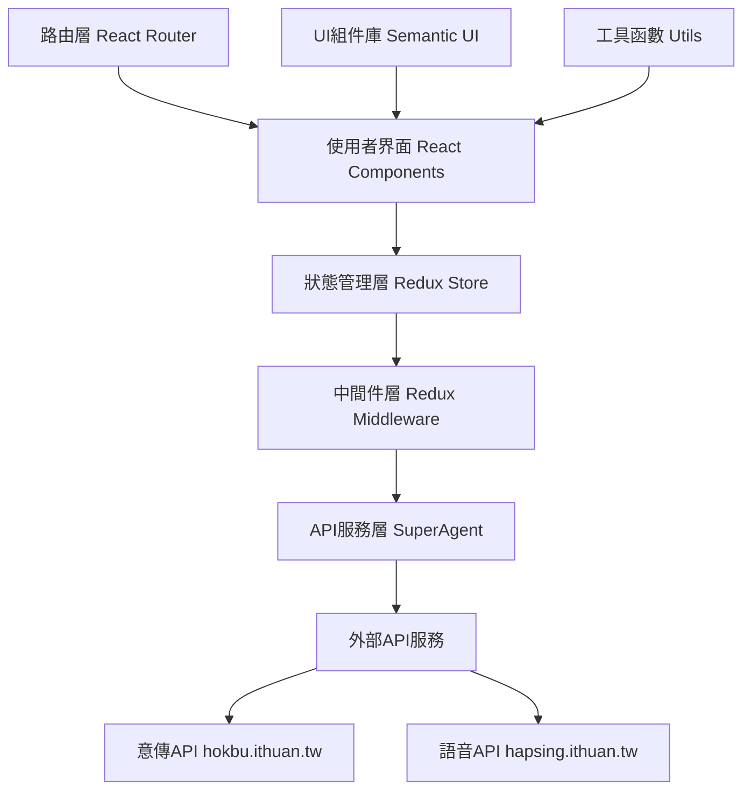

# 鬥拍字 (TauPhahJi-BangTsam) - 完整專案說明書

[](https://app.travis-ci.com/i3thuan5/TauPhahJi-BangTsam)

## 📋 目錄
1. [專案概述](#1-專案概述)
2. [技術架構](#2-技術架構)
3. [目錄結構詳解](#3-目錄結構詳解)
4. [功能特色](#4-功能特色)
5. [安裝與運行](#5-安裝與運行)
6. [開發指南](#6-開發指南)
7. [API文檔](#7-api文檔)
8. [組件文檔](#8-組件文檔)
9. [狀態管理](#9-狀態管理)
10. [部署說明](#10-部署說明)

---

## 1. 專案概述

### 🏷️ 基本資訊
- **專案名稱**: 鬥拍字 (TauPhahJi-BangTsam)
- **專案描述**: 臺語文本工具，提供臺語翻譯和語音朗讀功能
- **專案版本**: 1.0.0
- **開發作者**: 薛丞宏
- **開源授權**: MIT License
- **官方網站**: [https://suisiann.ithuan.tw](https://suisiann.ithuan.tw)
- **GitHub倉庫**: [https://github.com/i3thuan5/tau3_phah4-ji7](https://github.com/i3thuan5/tau3_phah4-ji7)
- **維護組織**: 意傳文化科技

### 🎯 專案目標
鬥拍字是一個專為台語學習和使用而設計的線上工具，致力於：
- **語言保存**: 促進台語文化的數位化保存
- **學習輔助**: 提供台語學習者實用的工具
- **標準化**: 推動台語文字標準化
- **可及性**: 讓更多人能夠接觸和學習台語

### 🌟 核心價值
- **開放源碼**: 採用MIT授權，鼓勵社群參與
- **技術創新**: 結合現代Web技術與語言學習
- **文化傳承**: 透過科技手段保存台語文化
- **使用者友善**: 注重使用者體驗和介面設計

---

## 2. 技術架構

### 🛠️ 核心技術棧

| 技術類別 | 技術名稱 | 版本 | 用途說明 |
|---------|---------|------|---------|
| 前端框架 | React | 15.5.4 | 使用者介面建構 |
| 狀態管理 | Redux | 3.6.0 | 應用程式狀態管理 |
| 異步處理 | Redux Thunk | 2.2.0 | 處理非同步Action |
| 路由管理 | React Router | 2.5.2 | 單頁應用路由 |
| UI框架 | Semantic UI | 2.2.10 | 使用者介面樣式 |
| 構建工具 | Webpack | 2.5.1 | 模組打包和建構 |
| 編譯工具 | Babel | 6.x | ES6+語法轉換 |
| HTTP客戶端 | SuperAgent | 3.7.0 | API請求處理 |
| 開發工具 | ESLint | 4.18.2 | 代碼風格檢查 |

### 🏗️ 系統架構圖



### 🔄 資料流程

```
1. 使用者輸入台語文字
2. 觸發Action Creator
3. Middleware處理非同步請求
4. API請求到外部服務
5. 收到回應後更新Store
6. 組件重新渲染顯示結果
7. 提供語音播放和下載功能
```

---

## 3. 目錄結構詳解

```
TauPhahJi-BangTsam-main/
├── 📁 src/                          # 📦 原始碼根目錄
│   ├── 📁 actions/                  # 🎬 Redux動作定義
│   │   ├── 📄 index.js             # 主要Action創建器
│   │   └── 📄 action.type.js       # Action類型常數定義
│   ├── 📁 api/                     # 🌐 API接口定義
│   │   └── 📄 index.js             # API端點配置和URL管理
│   ├── 📁 config/                  # ⚙️ 配置管理
│   │   └── 📄 index.js             # 配置讀取和處理
│   ├── 📁 providers/               # 🔗 根組件提供者
│   │   └── 📄 index.jsx            # Redux Provider和路由配置
│   ├── 📁 reducers/                # 🔄 狀態處理器
│   │   ├── 📄 index.js             # 根Reducer組合器
│   │   ├── 📄 查詢.js              # 查詢相關狀態管理
│   │   └── 📄 查詢結果.js          # 查詢結果狀態管理
│   ├── 📁 utils/                   # 🛠️ 工具函數庫
│   │   └── 📄 複製.js              # 文字複製功能工具
│   ├── 📁 網站/                   # 🏠 網站布局組件
│   │   ├── 📄 網站.jsx             # 主要布局容器
│   │   ├── 📄 頁頭.jsx             # 網站頭部組件
│   │   └── 📄 頁尾.jsx             # 網站底部組件
│   ├── 📁 頁/                     # 📄 頁面級組件
│   │   └── 📁 查/                  # 🔍 查詢功能頁面
│   │       ├── 📄 查.jsx           # 查詢頁面主組件
│   │       ├── 📄 查.css           # 查詢頁面專用樣式
│   │       ├── 📄 查表格.jsx       # 查詢輸入表格組件
│   │       └── 📄 查表格.container.js # 查詢表格容器組件
│   ├── 📁 元素/                   # 🧩 UI元素組件
│   │   ├── 📁 顯示/               # 👁️ 顯示相關組件
│   │   │   ├── 📄 漢羅列表.jsx     # 漢字羅馬拼音列表組件
│   │   │   └── 📄 漢羅列表.container.js # 列表容器組件
│   │   └── 📁 翻譯/               # 🔄 翻譯功能組件
│   │       ├── 📄 翻譯結果.jsx     # 翻譯結果顯示組件
│   │       └── 📄 翻譯結果.container.js # 結果容器組件
│   └── 📄 index.js                 # 🚀 應用程式入口點
├── 📁 favicons/                    # 🖼️ 網站圖標集合
├── 📁 build/                       # 📦 構建輸出目錄
├── 📄 index.html                   # 🌐 主HTML模板
├── 📄 package.json                 # 📋 專案依賴配置
├── 📄 package-lock.json            # 🔒 依賴版本鎖定
├── 📄 taupahji.config.js          # ⚙️ 專案自定義配置
├── 📄 webpack.config.dev.js        # 🛠️ 開發環境Webpack配置
├── 📄 webpack.config.prod.js       # 🏭 生產環境Webpack配置
├── 📄 devServer.js                 # 🖥️ 開發服務器配置
├── 📄 .babelrc                     # 🔧 Babel轉換配置
├── 📄 .eslintrc.json              # 📏 ESLint代碼規範配置
├── 📄 .gitignore                  # 🚫 Git忽略文件列表
├── 📄 .travis.yml                 # 🤖 CI/CD自動化配置
├── 📄 LICENSE                     # 📜 開源授權文件
└── 📄 README.md                   # 📖 專案基本說明
```

### 📁 重要目錄說明

#### `/src/actions/` - Redux動作定義
- 包含所有Redux Action創建器
- 管理API請求的生命週期
- 定義狀態變更的觸發點

#### `/src/api/` - API接口管理
- 統一管理外部API端點
- 配置API基礎URL和參數
- 提供API調用的統一介面

#### `/src/reducers/` - 狀態管理
- 處理應用程式的狀態變更
- 分模組管理不同功能的狀態
- 確保狀態變更的純函數特性

#### `/src/元素/` - 可重用UI組件
- 包含可重用的使用者介面元素
- 分類管理不同功能的組件
- 遵循組件設計原則

---

## 4. 功能特色

### 🎯 核心功能模組

#### 4.1 台語文字查詢與轉換
```
🔍 輸入支援:
  • 純台語漢字輸入
  • 漢字與羅馬拼音混合輸入
  • 支援各種標點符號和空格

🔤 標音轉換:
  • 自動漢字轉羅馬拼音標音
  • 支援台羅拼音系統
  • 提供聲調標示

📝 分詞處理:
  • 智能分詞演算法
  • 詞彙邊界識別
  • 語義結構分析

🗣️ 腔口支援:
  • 預設閩南語腔調
  • 可擴展其他台語腔口
  • 腔調特殊標音處理
```

#### 4.2 語音合成 (TTS) 系統
```
🎵 整段朗讀功能:
  • 完整句子語音合成
  • 自然語調處理
  • 支援長文本朗讀

🔊 單詞發音功能:
  • 個別詞語精確發音
  • 聲調準確度高
  • 適合語言學習

💾 音檔操作:
  • 即時播放功能
  • 音檔下載儲存
  • 多種音頻格式支援

⚡ 使用限制管理:
  • 每IP每分鐘3次下載限制
  • 資源使用優化
  • 服務穩定性保障
```

#### 4.3 結果展示與互動
```
📊 漢羅對照顯示:
  • 漢字與拼音並排顯示
  • Ruby HTML標籤標音
  • 視覺清晰易讀

📋 多格式複製:
  • 純漢字複製
  • 純羅馬字複製
  • 漢羅混合複製
  • 分詞格式複製

🎛️ 互動操作:
  • 一鍵複製功能
  • 播放/暫停控制
  • 下載進度顯示
```

#### 4.4 響應式與無障礙設計
```
📱 跨設備適配:
  • 桌面電腦最佳化
  • 平板裝置適配
  • 手機介面優化
  • 觸控友善設計

♿ 無障礙功能:
  • 鍵盤導航支援
  • 螢幕閱讀器相容
  • 高對比度選項
  • 字體大小調整

🚀 PWA功能:
  • 離線快取支援
  • 快速載入體驗
  • 桌面安裝選項
  • 推播通知準備

🔍 SEO優化:
  • 完整meta標籤
  • 結構化資料標記
  • 語義化HTML
  • 搜尋引擎友善
```

### 🎨 使用者介面設計

#### 介面布局結構
```
┌─────────────────────────────────────────────┐
│                 🏠 頁面頭部                  │
│           品牌標誌 | 導航選單               │
├─────────────────────────────────────────────┤
│                                             │
│  📝 台語文字輸入區域                        │
│  ┌─────────────────────────────────────────┐ │
│  │ 請輸入台語文字...                       │ │
│  │                               [查詢]  │ │
│  └─────────────────────────────────────────┘ │
│                                             │
├─────────────────────────────────────────────┤
│  🔧 操作工具列                              │
│  ┌─────────┐ ┌─────────┐ ┌─────────────────┐ │
│  │複製漢字  │ │複製羅馬字│ │  🔊 整段播放   │ │
│  └─────────┘ └─────────┘ └─────────────────┘ │
│  ┌─────────┐ ┌─────────┐ ┌─────────────────┐ │
│  │複製漢羅  │ │複製分詞  │ │  💾 整段下載   │ │
│  └─────────┘ └─────────┘ └─────────────────┘ │
├─────────────────────────────────────────────┤
│  📊 查詢結果顯示區域                        │
│  ┌─────────────────────────────────────────┐ │
│  │ 🔊 💾  漢字詞彙                        │ │
│  │        tâi-gí pîn-im                   │ │
│  │ ─────────────────────────────────────  │ │
│  │ 🔊 💾  下一個詞                        │ │
│  │        he̍h-tsi̍t-ê tî                   │ │
│  └─────────────────────────────────────────┘ │
├─────────────────────────────────────────────┤
│                 🦶 頁面底部                  │
│         版權資訊 | 相關連結 | 聯絡方式      │
└─────────────────────────────────────────────┘
```

### 📊 功能特色總結

| 功能類別 | 主要特色 | 技術亮點 | 使用者價值 |
|---------|---------|---------|-----------|
| **文字處理** | 智能分詞、標音轉換 | NLP演算法、API整合 | 學習輔助、標準化 |
| **語音合成** | TTS播放、音檔下載 | 外部API、音頻處理 | 發音學習、聽力訓練 |
| **使用者體驗** | 響應式設計、PWA | React、Service Worker | 跨設備使用、離線存取 |
| **資料操作** | 多格式複製、匯出 | JavaScript API、格式轉換 | 資料重用、工作流整合 |

---

## 5. 安裝與運行

### 💻 系統需求

#### 最低系統要求
```
作業系統: Windows 10 / macOS 10.12 / Ubuntu 16.04
處理器:   雙核心 2.0GHz 或以上
記憶體:   4GB RAM
硬碟空間: 500MB 可用空間
網路:     寬頻網際網路連接
```

#### 開發環境要求
```
Node.js:  >= 6.0.0 (建議使用 LTS 版本)
npm:      >= 3.0.0 (或 yarn >= 1.0.0)
Git:      >= 2.0.0
瀏覽器:    Chrome 60+ / Firefox 55+ / Safari 10+
```

### 🚀 快速開始指南

#### 步驟 1: 獲取專案源碼
```bash
# 方法一: 使用 Git 克隆
git clone https://github.com/i3thuan5/tau3_phah4-ji7.git
cd tau3_phah4-ji7

# 方法二: 下載 ZIP 檔案
# 1. 前往 GitHub 頁面
# 2. 點擊 "Code" > "Download ZIP"
# 3. 解壓縮到目標目錄
```

#### 步驟 2: 安裝專案依賴
```bash
# 檢查 Node.js 版本
node --version  # 應該顯示 v6.0.0 或更高版本

# 檢查 npm 版本
npm --version   # 應該顯示 3.0.0 或更高版本

# 安裝專案依賴 (這可能需要幾分鐘)
npm install

# 如果遇到權限問題 (Linux/macOS)
sudo npm install

# 如果使用 yarn (可選)
yarn install
```

#### 步驟 3: 啟動開發服務器
```bash
# 啟動開發服務器
npm start

# 服務器啟動成功後會看到類似訊息:
# Local:            http://localhost:3000
# On Your Network:  http://您的IP地址:3000
```

#### 步驟 4: 瀏覽器存取
```
1. 開啟瀏覽器
2. 前往 http://localhost:3000
3. 應該看到「鬥拍字」首頁
4. 嘗試輸入台語文字進行測試
```

### 🛠️ 可用指令大全

#### 開發相關指令
```bash
# 啟動開發服務器 (含熱重載)
npm start

# 檢查代碼風格 (ESLint)
npm run check

# 自動修復代碼風格問題
npm run reformat

# 清除快取和依賴 (故障排除)
npm cache clean --force
rm -rf node_modules package-lock.json
npm install
```

#### 建構與部署指令
```bash
# 建構生產版本
npm run build

# 建構完成後，檔案會在 build/ 目錄中
ls build/

# 預覽建構結果 (需要靜態服務器)
npx serve build

# 部署到 GitHub Pages
npm run deploy
```

#### 測試與品質檢查
```bash
# 執行程式碼風格檢查
npm run check

# 查看詳細的 linting 結果
./node_modules/.bin/eslint --ext .js --ext .jsx src/

# 修復可自動修復的問題
npm run reformat

# 檢查依賴安全性
npm audit

# 自動修復安全問題
npm audit fix
```

### ⚙️ 環境配置

#### 專案配置檔案 (taupahji.config.js)
```javascript
module.exports = {
  // 專案基本資訊
  專案: "鬥拍字",
  
  // 支援的腔口列表
  腔口: ["閩南語"],
  
  // 預設查詢範例
  範例查詢: "逐家tsò-hué來chhit4-tho5！",
  
  // 頁尾連結配置
  頁尾連結: [
    {
      title: "Facebook",
      url: "https://www.facebook.com/ithuan.tw/"
    },
    {
      title: "Github", 
      url: "https://github.com/i3thuan5/tau3_phah4-ji7"
    },
    {
      title: "意傳科技",
      url: "https://ithuan.tw/"
    },
    {
      title: "語料來源",
      url: "https://github.com/sih4sing5hong5/tai5-uan5_gian5-gi2_hok8-bu7/wiki/Taiwanese-Corpus%E8%AA%9E%E6%96%99"
    }
  ]
};
```

#### 開發環境變數
```bash
# 設定開發模式
NODE_ENV=development

# 設定 API 基礎 URL (可選)
REACT_APP_API_BASE_URL=https://hokbu.ithuan.tw

# 設定埠號 (預設 3000)
PORT=3000

# 啟用/停用 ESLint
DISABLE_ESLINT_PLUGIN=false
```

#### Webpack 開發配置重點
```javascript
// webpack.config.dev.js 重要配置
{
  // 啟用熱重載
  devtool: "cheap-module-eval-source-map",
  
  // 開發服務器配置
  devServer: {
    hot: true,
    historyApiFallback: true,
    port: 3000
  },
  
  // 模組解析配置
  resolve: {
    extensions: [".js", ".jsx"],
    alias: {
      tensuConfig: path.join(path.resolve(), "taupahji.config.js")
    }
  }
}
```

### 🔧 故障排除

#### 常見安裝問題
```bash
# 問題 1: npm install 失敗
# 解決方案:
npm cache clean --force
rm -rf node_modules package-lock.json
npm install

# 問題 2: 權限錯誤 (Windows)
# 以管理員身分執行命令提示字元

# 問題 3: 網路連線問題
# 設定 npm 代理 (如果需要)
npm config set proxy http://proxy.company.com:8080
npm config set https-proxy http://proxy.company.com:8080
```

#### 常見執行問題
```bash
# 問題 1: 埠號被佔用
# 查看佔用的程序
netstat -ano | findstr :3000  # Windows
lsof -ti:3000                 # macOS/Linux

# 使用不同埠號
PORT=3001 npm start

# 問題 2: 瀏覽器快取問題
# 清除瀏覽器快取或使用無痕模式

# 問題 3: API 連線問題
# 檢查網路連線和防火牆設定
``` 